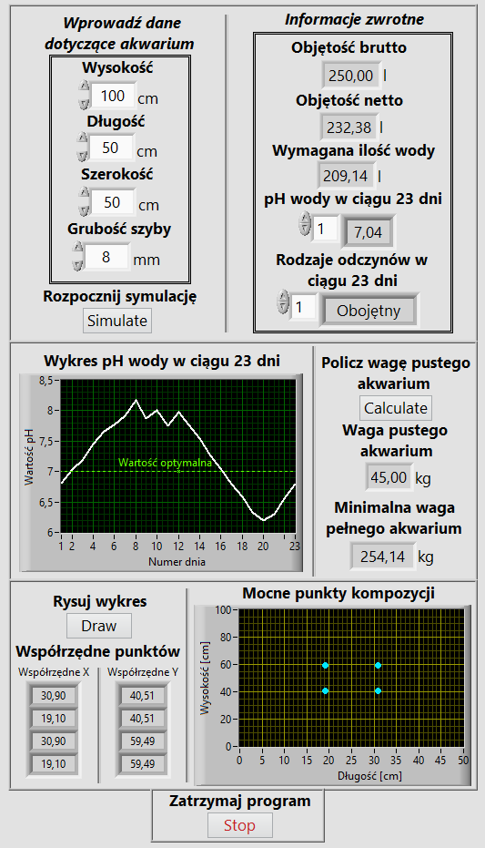

# LabVIEW Aquarium Project
## Introduction
Repository contains files and documentation (PL) of LabVIEW project (Wrocław University of Science and Technology/Faculty of Electronics/Electronics/4th Semester/Data Acquisition and Processing Systems).

## Setup
Run a project file (Main.vi) in LabView.

## Preview (PL)

  

## Documentation (PL)
https://wieczorek-daniel.github.io/labview-aquarium-project/

